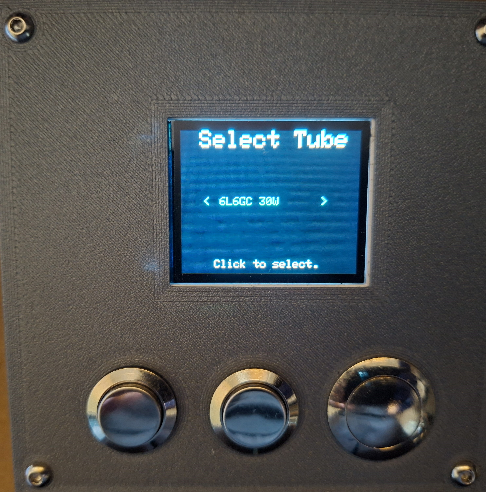
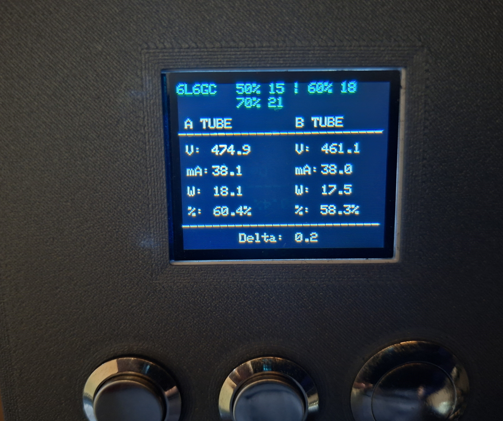
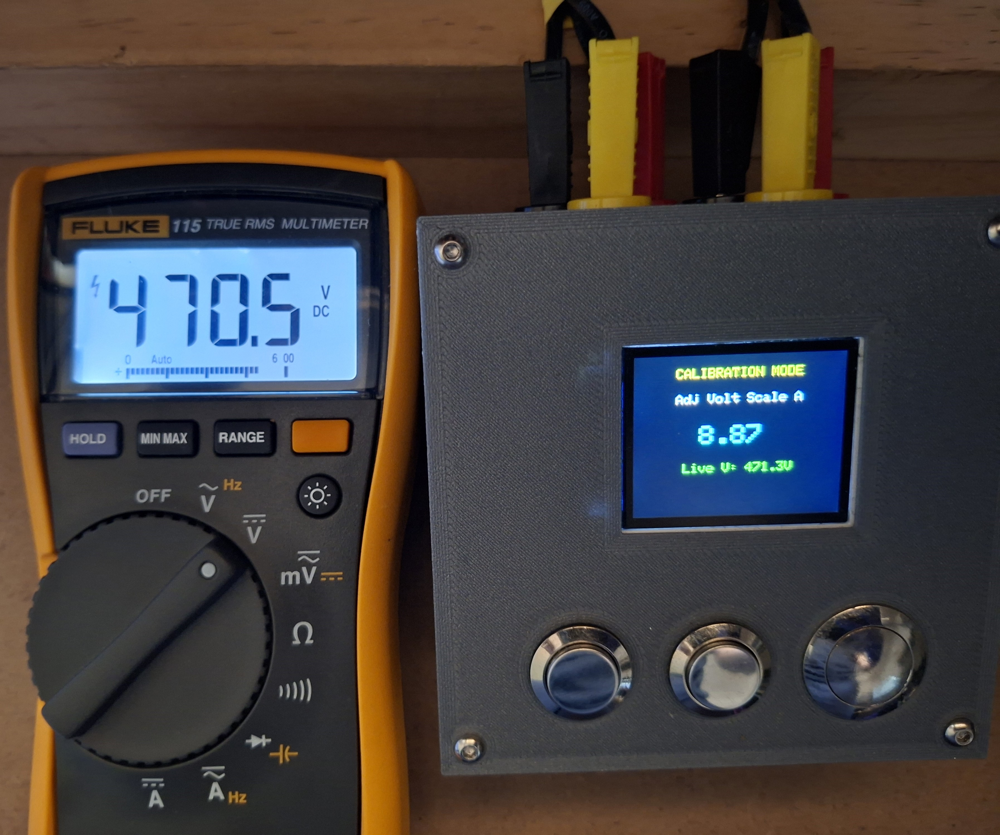
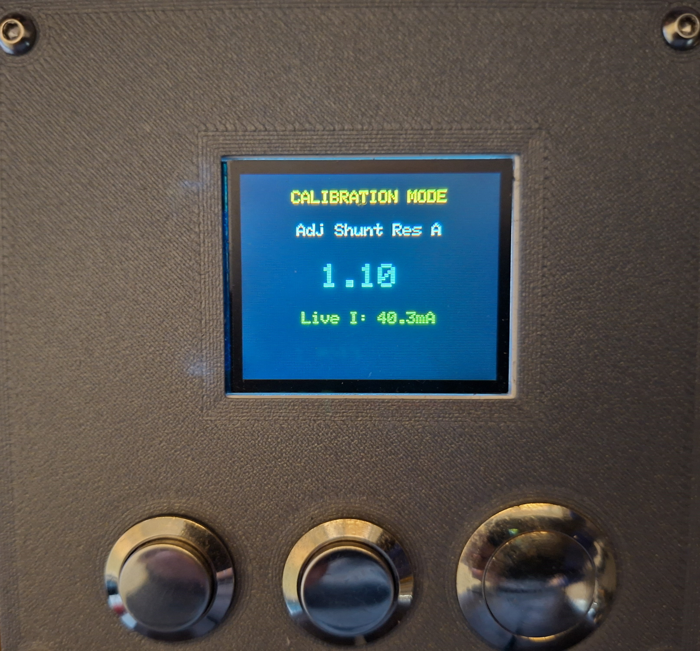
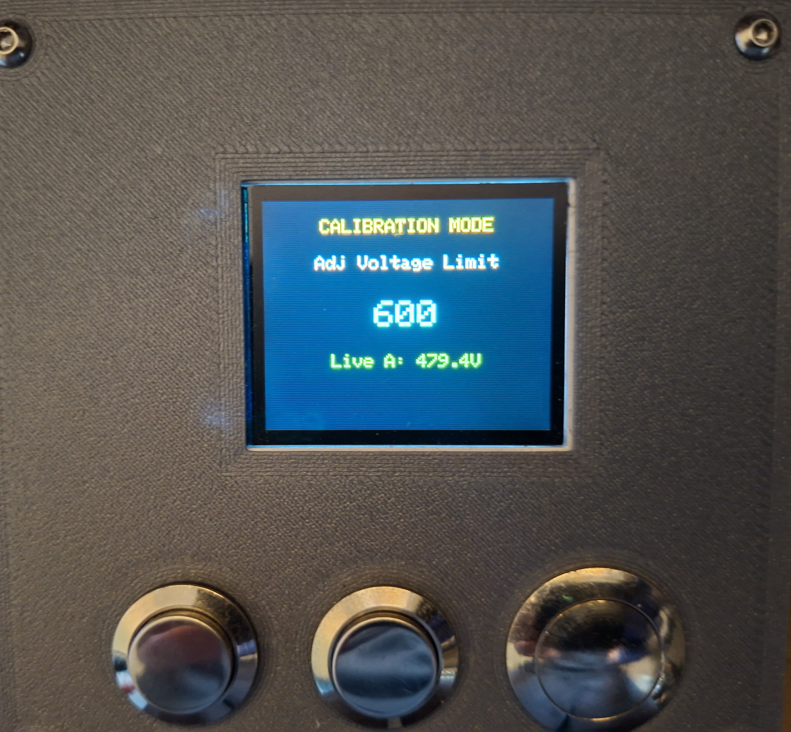
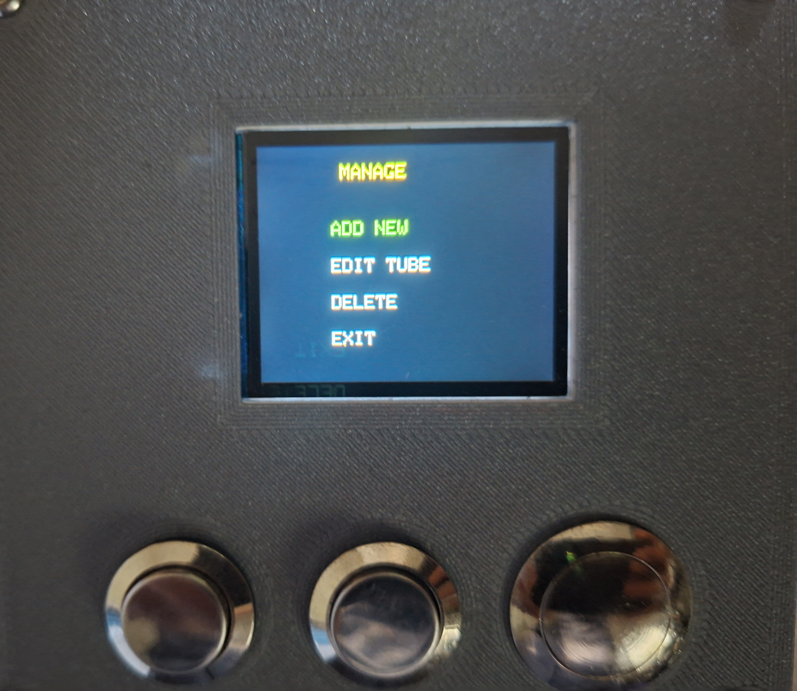
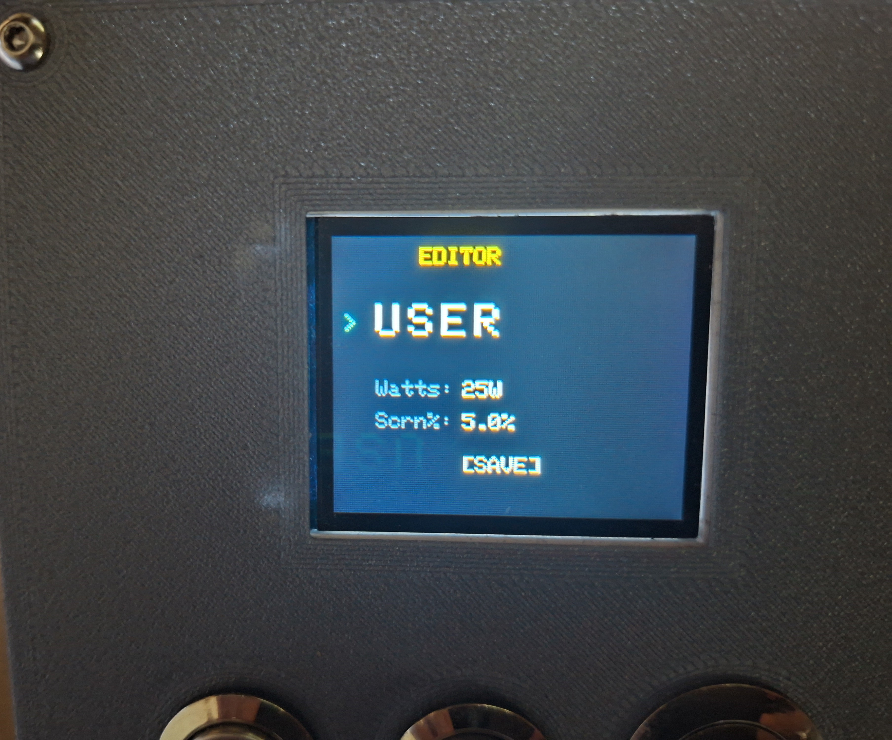
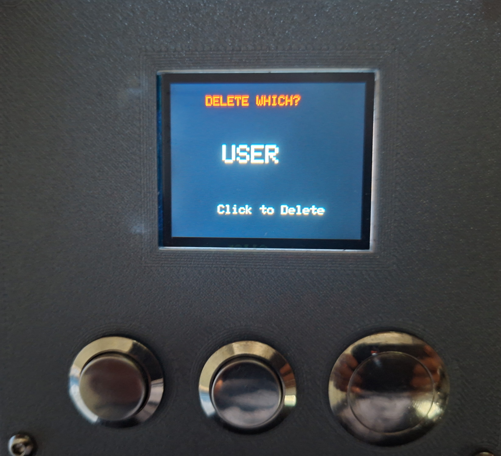
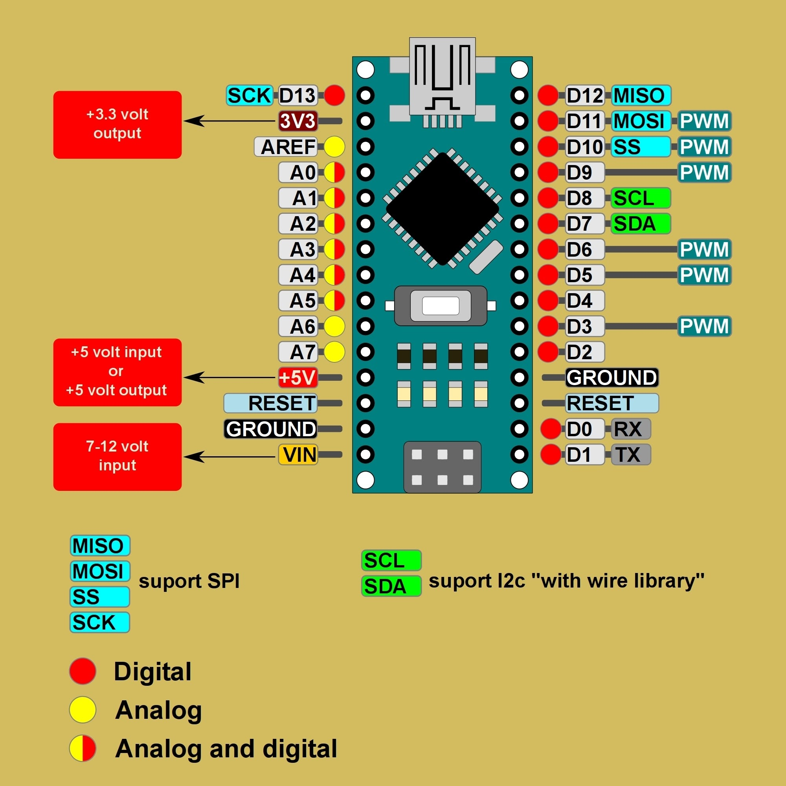
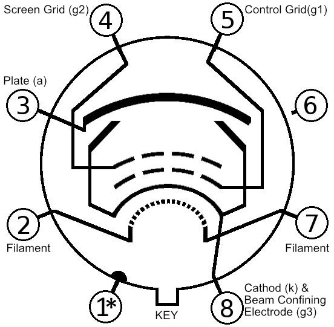

# 🎛️ Arduino Tube Amp BiasPro

This repository contains the complete, mathematically hardened firmware for a professional-grade, dual-probe vacuum tube bias meter. Designed for guitar amplifier technicians, this tool provides real-time, high-resolution measurements of Plate Voltage, Cathode Current, and True Plate Dissipation (Watts & %) for power tubes (e.g., 6L6GC, EL34, 6V6, KT88).

This firmware was completely re-architected from scratch using modern, memory-safe embedded C++ principles to eliminate dynamic memory leaks and ensure rock-solid physical safety lockouts.

| **1. Splash Screen** | **2. Tube Select** | **3. Live Bias Mode** |
| :---: | :---: | :---: |
|  |  |  |
| **4.  Calibration Voltage Scale** | **5. Calibration Shunt Resistor** | **6. Calibration Voltage Limiter** |
|  |  |  |
| **7. Tube Manager** | **8. Tube Manager - Editor** | **9. Tube Manager - Delete a Profile** |
|  |  |  |

---

## ⚠️ High-Voltage Safety Warning
**LETHAL VOLTAGES ARE PRESENT IN TUBE AMPLIFIERS.**

Tube amplifiers store lethal voltages in their filter capacitors even after being unplugged. This firmware is only a measurement tool; it **cannot** make unsafe wiring or handling safe. 
* Never connect the USB port to a computer while the probes are plugged into a live amplifier. 
* Always use a dummy load or speaker cabinet.
* If you are not trained in high-voltage safety, take your amplifier to a qualified technician. Build and use this project entirely at your own risk.

---

> [!CAUTION]
> ## ⚠️ WARNING: HIGH VOLTAGE SAFETY
>
> **Tube amplifiers contain lethal high voltage (often 400V–500V+), even when powered off and unplugged.**
>
> This project involves building and using test equipment that interfaces directly with these dangerous circuits.
> * **Risk of Death:** Incorrect wiring of the bias probes or misuse of this device can expose you to lethal current.
> * **Filter Capacitors:** High voltage can remain stored in the amplifier's capacitors long after the power is cut. You must know how to safely drain filter capacitors before opening any chassis.
> * **Qualified Personnel Only:** If you are not trained in high-voltage safety or are uncomfortable working with live circuits, **do not build or use this device**. Take your amplifier to a qualified technician instead.
>
> **DISCLAIMER & NO SUPPORT:** This project is provided "as is" with **no warranty and no technical support**. The author cannot provide assistance with assembly, troubleshooting, or code modifications. The author assumes no liability for injury, death, or equipment damage resulting from the use or construction of this device. **Use entirely at your own risk.**

> [!IMPORTANT]
> ### ⚡ Critical Safety: Capacitor Discharge
> Before touching any internal component or connecting probes to a chassis, you must verify the filter capacitors are drained.
>
> * **The Golden Rule:** Always measure with a multimeter to confirm 0VDC before touching anything.
> * **Discharge Tool:** Do not rely on the amp to drain itself. Use a dedicated **Capacitor Discharge Tool** to safely bleed off voltage.
>      * *DIY Tip:* You can build one using a high-wattage resistor (e.g., **2kΩ to 5kΩ, 5 Watts**) wired to a probe and an alligator clip for ground. This slows the discharge **and** prevents sparking, unlike a screwdriver short.
> * **One-Hand Rule:** When working on live amps, keep one hand in your pocket to prevent current from passing across your chest/heart.

> [!NOTE]
> ### 🛡️ Recommended Safety Gear
> If you are working inside a live amplifier chassis, we strongly recommend using the following safety equipment:
> 
> * **Isolation Transformer:** This isolates the amplifier from the mains earth ground, significantly reducing the risk of lethal shock if you accidentally touch a live component while grounded.
> * **Dim Bulb Limiter (Current Limiter):** Essential when powering up an amplifier for the first time after a repair. It prevents catastrophic damage (blown transformers) if there is a short circuit.
>      * **⚠️ CRITICAL WARNING:** Do **NOT** attempt to set the final bias while running through a Dim Bulb Limiter. The limiter drops the wall voltage, which lowers the plate voltage and gives false low bias readings. Always bypass the limiter for the final precision bias adjustment.
> * **Variac (Variable Transformer):** Highly recommended for two purposes:
>      1.  **Voltage Stabilization:** Wall voltage fluctuates. A Variac allows you to set the input voltage exactly to your country's standard (e.g., 240V in Australia, 120V in USA, 230V in UK). This ensures your bias readings are accurate and consistent, rather than drifting with high/low wall voltage.
>      2.  **Soft Start / Reforming:** Useful for slowly bringing up the voltage on vintage amplifiers to reform old capacitors safely.

> [!TIP]
> **New to Biasing?** Check out our dedicated guide:
> ### 📖 [Read the Step-by-Step Biasing Guide](BIASING_GUIDE.md)
> *Learn how to safely bias Fender Prosonic & Fixed-Bias Amps.*

---

## ⚙️ Hardware Specifications

* **MCU:** Arduino Nano / ATmega328P
* **Display:** ST7735 1.8" TFT SPI
* **ADC:** ADS1115 (16-bit) at I2C address `0x48`
* **Inputs:** Three tactile switches (Left, Right, Center)

### Immutable Pin Map
| Function | Arduino Nano Pin |
| :--- | :--- |
| **TFT SCLK** | D13 |
| **TFT MOSI** | D11 |
| **TFT CS** | D10 |
| **TFT DC** | D9 |
| **TFT RST** | D8 |
| **Button Center** | D7 (Uses `INPUT_PULLUP`) |
| **Button Right** | D6 (Uses `INPUT_PULLUP`) |
| **Button Left** | D5 (Uses `INPUT_PULLUP`) |
| **ADS1115 SDA** | A4 |
| **ADS1115 SCL** | A5 |

---

## 🛠️ Build & Flash Instructions

### 1. Pinned Dependencies
To guarantee a successful compile, you **must** use these exact library versions in the Arduino IDE:
* `Adafruit GFX Library` v1.12.6
* `Adafruit ST7735 and ST7789 Library` v1.11.0
* `Adafruit BusIO` v1.17.4

### 2. CRITICAL: 99% Flash Memory Limit & The "Old Bootloader"
The firmware compiles to approximately **30,702 bytes**. It will successfully flash to a standard Arduino Nano (Old Bootloader) with very few bytes to spare. 

* **Using a Standard Nano or USB-C Clone:** The firmware will successfully flash to a standard Arduino Nano using the `Processor: ATmega328P (Old Bootloader)` setting in the Arduino IDE. The old bootloader leaves exactly 30,720 bytes of usable flash space, meaning this firmware fits with roughly **18 bytes to spare**. It works perfectly, but you cannot add any additional features or text without overflowing the memory.
* **If your upload fails (or you wish to add features):** You will need to upgrade your Nano to the modern *Optiboot* bootloader. To do this, burn the Optiboot bootloader to your Nano using an ISP programmer, and change your board selection in the Arduino IDE from "Arduino Nano" to **"Arduino Uno"**. Optiboot only consumes 0.5KB, which will instantly free up an additional 1.5KB of flash space.

### 3. EMI & I2C Freeze Protection
Tube amplifiers are electrically noisy environments. High voltage spikes, flyback EMF, or loose tube socket connections can create strong Electromagnetic Interference (EMI) that can lock up the internal I2C bus connecting the Arduino to the ADS1115 ADC.

To protect against these EMP-like events, this firmware completely bypasses the standard Adafruit ADC library and manually writes to the I2C registers. More importantly, it utilizes the modern `Wire.setWireTimeout(25000, true)` feature. 
* **How it works:** If the I2C bus freezes due to interference, the system detects the hang within 25 milliseconds, automatically resets the I2C hardware pins, and immediately resumes reading the Bias probes without ever rebooting the Arduino or losing your place on the screen.
* **Why no Hardware Watchdog Timer (WDT)?** Older versions of this project used the hardware WDT. However, a severe silicon bug in common LGT8F328P Arduino Nano clones caused the WDT to trigger infinite boot-loop crashes during UI updates. The software-level `Wire` timeout is infinitely more reliable, handles EMI elegantly, and completely avoids these bootloader bugs.

---

## ⚠️ Troubleshooting

### 1. Upload Failed? (stk500 Error)
If you are unable to upload the firmware and see an error like `stk500_recv(): programmer is not responding`:
* **The Cause:** You are likely using an older Arduino Nano (or a generic clone) that uses the legacy bootloader.
* **The Fix:** In the Arduino IDE, go to **Tools > Processor** and change the setting from "ATmega328P" to **"ATmega328P (Old Bootloader)"**. Then try uploading again.
* *Note:* Newer official Nanos (and USB-C versions) usually use the standard "ATmega328P" setting.

### 2. The "Boot Loop" Issue (Legacy Hardware)
Some older Arduino Nano boards (and many low-cost clones) came with an outdated "Bootloader" that had a bug preventing the chip from recovering correctly after a hardware Watchdog Reset. 
* **The Fix:** This has been permanently fixed in this modern codebase! We completely stripped out the hardware Watchdog Timer and replaced it with a targeted `Wire.setWireTimeout` bus reset. You should no longer experience infinite boot loops when encountering EMI. If you do, ensure you have correctly installed the `Wire` library updates in the Arduino IDE.

### 3. Adafruit Display Clones ST7735 1.8" TFT - White Screen / Static / Wrong Colors?
If your display lights up but shows static, garbage pixels, or wrong colors:
* **The Cause:** You likely have a "Green Tab" or "Red Tab" clone display. The plastic tab on the screen protector often indicates the internal driver version.
* **The Fix:** Open the firmware source code (`DisplayManager.cpp` or main `.ino` configuration) and find the initialization line: `tft.initR(INITR_18BLACKTAB);` 
Change it to one of the following and re-upload until the screen looks correct:
  * `tft.initR(INITR_18GREENTAB);`
  * `tft.initR(INITR_18REDTAB);`

---

## 💻 Software & Development Environment

This project is written as a standard Arduino sketch (`.ino`) and was developed using the official **Arduino IDE**.

* **Recommended Method:** We strongly recommend using the **Arduino IDE** for the easiest setup. Its built-in *Library Manager* (Tools > Manage Libraries) makes it simple to install the required dependencies (Adafruit GFX, ADS1X15, etc.) without complex manual configuration.
* **Alternative IDEs:** Advanced users can compile this code in other environments, such as **Visual Studio Code (with PlatformIO)** or **Microchip Studio**. However, please note that you will need to manually manage library paths and dependencies.
* **📥 Download Official Arduino IDE:** [Download Official Arduino IDE](https://www.arduino.cc/en/software)

---

## Features

BiasPro introduces professional-grade data integrity and safety features not found in standard DIY alternatives.

### 🛠 Core Functionality
* **Dual Probe Measurement:** Simultaneous real-time monitoring of Tube A and Tube B.
* **True Plate Dissipation:** Calculates power (Watts) and dissipation percentage based on the specific tube type.
* **Screen Current Correction:** Implements industry-standard math to subtract estimated screen current, ensuring the displayed bias represents true *Plate* dissipation, not just Cathode current.

### 💾 Robust Data Integrity
* **Checksum Protection:** The EEPROM data includes a computed checksum. If the memory is corrupted or a new chip is installed, the system detects the error and automatically restores safe default values, preventing dangerous behavior.
* **Safety Clamps:** The Calibration Menu now prevents users from accidentally setting dangerous values (e.g., setting a shunt resistor to 0.0Ω or a voltage scaler to 0), effectively "clamping" entries to safe, realistic ranges.

### 🛡️ Safety & Reliability
* **Active Over-Voltage Monitor:** Continuous safety checks will lock the interface and display a "DANGER" warning if probe voltage exceeds limits.
* **Safety Hysteresis:** The system requires a voltage drop of 50V (hysteresis) before resetting the safety lock, preventing rapid toggling near the limit.
* **Input Debouncing:** Advanced state-machine logic eliminates switch "recoil" and bounce, ensuring the cursor never jumps unintentionally.

### ⚙️ On-Board Calibration
* **Software Calibration:** Shunt resistance and Voltage Divider scaling can be adjusted via the screen menu and saved to EEPROM. You do not need to edit the source code to calibrate the unit.

---

## 🧠 How It Works (Theory of Operation)

For those interested in the engineering, here is how the Bias Meter safely measures high-voltage tube amplifiers.

### 1. Measuring Plate Voltage (The Voltage Divider)
The Arduino cannot measure 500V directly.
* **The Circuit:** Inside the probe, a **Voltage Divider** network scales the high voltage down to a safe range (0-5V).
* **The Math:** The device measures this low "safe" voltage and multiplies it by the **Voltage Scale Factor** (calibrated in software) to calculate the true High Voltage.
    * *Example:* 450V from the amp is stepped down to 4.5V for the ADC. The screen displays "450V".

### 2. Measuring Bias Current (The Shunt Resistor)
To measure current, we use **Ohm's Law** (`V = I × R`).
* **The Circuit:** The tube's cathode current flows through a precision **1Ω Shunt Resistor** to ground.
* **The Measurement:** The current flowing through the resistor creates a tiny voltage drop across it (e.g., 35mA of current creates 35mV).
* **The ADC:** The high-precision **ADS1115 ADC** measures this tiny voltage drop with extreme accuracy. The Arduino then converts that millivolt reading directly into milliamps (since 1mV = 1mA across a 1Ω resistor).

### 3. Calculating Dissipation (The Wattage)
Once the system knows the Voltage (V) and the Current (I), it calculates the Plate Dissipation in real-time.
* **Formula:** `Watts = Plate Voltage × Plate Current`
* **Screen Correction:** If enabled, the system first subtracts the estimated Screen Current from the total current to ensure the Wattage displayed is for the **Plate only**, providing the most accurate bias reading possible.

---

## Bill of Materials (BOM)

| Quantity | Component | Description |
| :------- | :--- | :--- |
| 1 | Arduino Nano (Recommended: USB-C Version) | Microcontroller board (ATmega328P) |
| 1 | Adafruit ST7735 1.8" TFT | 160x128 Color TFT Display (SPI) |
| 1 | ADS1115 16-Bit ADC Module | High-precision 4-channel ADC (I2C) |
| 3 | Tactile Push Buttons | Menu navigation (Left, Right, Center/Select) |
| 1 | Project Enclosure | 3D printed case (See below) |
| - | Hook-up Wire | 22 AWG for internals |
| 2 | Bias Probes | Octal (8-pin) probes (e.g., TubeDepot Bias Scout or DIY) |

* **Download Link:** [Bill of Materials (BOM) for the BIASMETER.txt](./HARDWARE%20-%20PCB%20KICAD/Bill%20of%20Materials%20(BOM)%20for%20the%20BIASMETER.txt)

---

## 🛑 Hardware Compatibility & Critical Warnings

Before sourcing parts, please review these critical hardware constraints to ensure your build works correctly.

### 1. ADC Module: ADS1115 Only (No ADS1015)
* **⚠️ CRITICAL:** You **MUST** use the **ADS1115 (16-Bit)** ADC module.
* **Do NOT use the ADS1015:** This is a cheaper, 12-bit version that looks identical.
* **The Issue:** The firmware uses a specific multiplier (`0.0078125 mV/bit`) calculated for 16-bit resolution. If you use an ADS1015, your bias readings will be incorrect by a factor of 16.

### 2. Display: ST7735 TFT Only (No OLEDs)
* **Required:** Adafruit **ST7735 1.8" Color TFT** (or compatible).
* **Not Supported:** This firmware is **NOT** compatible with monochrome OLED displays (SSD1306 or SH1106) used in other versions.

### 3. Arduino Nano Bootloader
* **Recommendation:** We recommend buying an Arduino Nano with the modern **Optiboot** bootloader (often found on USB-C versions) to avoid Watchdog Timer boot loops if WDT is enabled.

### 4. Power Source (No Heater Power)
* **Supported:** Isolated USB Wall Charger or 9V Battery.
* **Not Supported:** Do **NOT** attempt to power this unit directly from the amplifier's 6.3V AC heater lines.
* **The Risk:** This hardware revision does not include the necessary rectification circuitry. Connecting heater lines to the Arduino will destroy the unit.

### 5. Isolation Transformers & USB
* **Clarification:** Even if you plug the amplifier into an **Isolation Transformer**, it is **STILL UNSAFE** to connect the Bias Meter's USB port to a computer while probing.
* **The Physics:** Most isolation transformers pass the **Earth Ground** pin straight through. This means the Ground Loop danger persists. **Never connect USB to a PC while the probes are in an amp. If you do so, you do it at your own risk!**

### 🛠️ Building the Probes (Recommended Kit)
We highly recommend the **Tube Depot Bias Scout Kit** for your hardware. It provides a professional, safe, and robust enclosure for the socket and resistor.
* **Product Link:** [Tube Depot Bias Scout Kit](https://www.tubedepot.com/products/tubedepot-bias-scout-kit)
* **Assembly Manual:** [Download PDF Instructions](https://s3.amazonaws.com/tubedepot-com-production/spree/attached_files/td_bias_scout_assy_manual_v3.2.pdf)

**Assembly Notes for this Project:**
1. **The Resistor:** The kit includes a **1Ω 1W resistor**. This is perfect for this project and matches the default calibration (1.00Ω).
2. **Wiring Colors:** If you follow the standard instructions, the output plugs will match this project's wiring guide:
   - **Red:** Plate Voltage (Connect to PCB `V_IN` via voltage divider).
   - **Black:** Ground (Connect to PCB `GND`).
   - **White:** Cathode Current (Connect to PCB `ADC_IN`).
3. **Connection:** You can either cut the banana plugs off and wire them directly to your PCB/Enclosure, or install female banana jacks on your Bias Meter enclosure for a detachable probe.

---

## 3D Printed Enclosure

A custom enclosure has been designed to house the Arduino Nano, Display, and Buttons safely.

* **Design Platform:** TinkerCAD
* **Editable Source:** [Bias Meter Enclosure V11 Files](https://www.tinkercad.com/things/gKRXVebJSTF/edit?sharecode=gUTg7qwfboPwH2RXnympp6uQYQx4FWwdrr1dFZcTKMg) *(Note: You must be logged into Tinkercad to access this link)*
* **Ready-to-Print Files:** [BiasMeter_Enclosure_STL](./HARDWARE%20-%20PCB%20KICAD/BiasMeter_Enclosure_STL)
  
**Printing Notes:**
You can export the `.STL` files directly from the link above. Standard PLA or PETG is suitable for this project. The case is designed to keep the low-voltage electronics isolated and secure.

---

## PCB Design & Fabrication

For a cleaner build and enhanced reliability, a custom PCB has been designed to replace hand-wiring. This board hosts the Arduino Nano, ADS1115, and input connectors.

### Key Hardware Features
* **Hardware Input Protection:** The board includes **1N4733A Zener Diodes (5.1V)** on the probe inputs. These clamp any incoming voltage spikes to ~5.1V, protecting the sensitive ADS1115 ADC from damage in case of a tube failure or surge.
* **Simplified Assembly:** Eliminates the "rat's nest" of wires common in DIY builds.
* **Fabrication Ready:** You can use the provided Gerber/KiCad files to order these boards from any fabrication house (e.g., PCBWay, JLCPCB, OSH Park).

### PCB Board Views

### PCB Board Components Views

### Schematic layout

* **Download Link:** [BiasMeter - KICAD](./HARDWARE%20-%20PCB%20KICAD/BiasMeter%20-%20KICAD)
  
**📥 Get KiCad Software:** [Download Official KiCad](https://www.kicad.org)

---

## Wiring / Pinout Guide

### Arduino Nano Connections
| Component | Pin Name | Nano Pin |
| :--- | :--- | :--- |
| **Buttons** | Left Button | D5 |
| | Right Button | D6 |
| | Select/Center | D7 |
| **Display (ST7735)** | CS | D10 |
| | DC (A0) | D9 |
| | RST | D8 |
| | SDA (MOSI) | D11 |
| | SCK (SCLK) | D13 |
| **ADC (ADS1115)** | SDA | A4 |
| | SCL | A5 |
| | VCC | 5V |
| | GND | GND |

### Arduino Nano Pinout 

### 🔌 Probe Wiring (Octal Sockets)
If you are building your own probes, correct wiring is essential for the math to work.
* **Pin 3 (Plate):** Connects to the Voltage Divider.
* **Pin 8 (Cathode):** Connects to the Shunt Resistor (and Ground).
* **Pin 1 & 8:** Often tied together in 6L6/EL34 amps.

*Figure: Standard Octal (8-Pin) Pinout (Bottom View).* 

---

## Powering the Device (Crucial Safety Info)

Correctly powering the Arduino Nano is critical to prevent damage to your computer, the bias meter, or the amplifier.

### 1. Recommended: Separate USB Power Adapter
The safest way to power this device during use is with a dedicated USB wall charger (like a standard phone charger).
* **Specs:** 5V Output, at least 500mA (0.5A).
* **Connector:** Mini-USB or USB-C (for Nano).
* **⚠️ IMPORTANT - 2-Prong Only:** You must use a charger that has only **2 prongs** (ungrounded).
    * **Why?** Tube amplifiers are grounded to Earth. If you use a grounded (3-prong) power adapter for the Arduino, you may create a **Ground Loop**. This can introduce noise, cause erratic readings, or in worst-case scenarios, short high voltage to ground through your low-voltage electronics. A 2-prong adapter is "floating," which isolates the meter from Earth ground.

### 2. Battery Power (9V)
You can power the Arduino Nano via the `VIN` and `GND` pins using a 9V battery.
* **Pros:** Complete electrical isolation (100% safe from ground loops), portable, zero mains noise.
* **Cons:** The Arduino, Display, and ADC consume current constantly. A standard 9V battery may drain relatively quickly.

### 3. ⚠️ WARNING: Computer USB Port
**DO NOT** power the bias meter from your computer's USB port while it is connected to an amplifier.
* **The Danger:** Desktop computers (and many laptops) are grounded. Connecting the USB cable ties the Arduino's Ground to the Computer's Earth Ground. Since the Probe's Ground is connected to the Amp's Ground, you create a direct Ground Loop.
* **Risk:** If a probe accident occurs or there is a voltage potential difference, high current could flow through the USB cable, destroying your computer's motherboard, the Arduino, or the amplifier.

#### When is Computer USB safe?
* **Uploads:** It is safe to connect to the computer to upload code **ONLY IF** the bias probes are **disconnected** from the amplifier.
* **Debugging:** You can use the Arduino IDE Serial Monitor to view debug logs, but **ensure the probes are NOT connected to a live amplifier**. If you must debug a live circuit, you must use a **USB Isolator** to protect your equipment.

---

## Installation

1. **Library Dependencies:** Install the following via the Arduino IDE Library Manager:
   - `Adafruit GFX Library`
   - `Adafruit ST7735 and ST7789 Library`
   - `Adafruit ADS1X15`
2. **Hardware Setup:**
   - **ADS1115:** Connect via I2C (SDA -> A4, SCL -> A5).
   - **TFT Display:** Connect via SPI (Pins 8, 9, 10, 11, 13 defined in code).
   - **Buttons:** Connect to Digital Pins 5 (Left), 6 (Right), and 7 (Center/Select).
3. **Upload:** Flash the `BiasPro` firmware to your Arduino Nano.

---

## User Guide & Navigation

### Basic Navigation
* **Left / Right Buttons:** Scroll through menus or adjust values.
* **Center Button (Short Click):** Select an item, confirm an edit, or advance to the next field.
* **Center Button (Long Hold):** Open the Tool Menu, access Sensor Telemetry, or return to the main screen.

### Firmware Quirks (By Design)

**1. The "Invisible Spaces" in the Profile Editor**
When creating a new tube profile, the Name field holds exactly **6 characters**. If you type a short name like `6V6` (3 characters), you still have 3 invisible blank spaces remaining. 
* **The Quirk:** The system will not drop down to the "Max Watts" line until you clear all 6 slots.
* **The Solution:** Simply rapid-click the **Center** button 3 times to skip past the invisible empty spaces and move to the next line.

**2. Screen Grid Current (`Src`) is in Permille (/1000)**
To calculate True Plate Dissipation, the BiasPro subtracts the Screen Grid Current from the Cathode reading. Floating-point decimals (like 5.5%) crash the Arduino's memory limit. Therefore, the firmware uses **Permille (parts-per-thousand)**. 
* To enter a percentage, simply multiply it by 10.
* **5.5%** = enter `55` /1000
* **13.0%** = enter `130` /1000
* **4.0%** = enter `40` /1000

---

## 🧪 Safe Biasing Protocol

1. **Bench Setup:** Connect your amplifier to a speaker load or reactive load box. An Isolation Transformer and a Variac are highly recommended for stable wall-voltage readings.
2. **Probe Connection:** Ensure the amplifier is powered OFF. Remove the power tubes, insert the BiasPro probes into the amp sockets, and place the tubes into the top of the probes.
3. **Select Tube Profile:** Power on the BiasPro. Select the matching tube profile (e.g., `6L6GC`). Press Center to enter **Live Bias Mode**.
4. **Power the Amp:** Turn the amplifier ON. Wait for the tubes to warm up, then disengage standby. 
5. **Adjust Bias:** Watch the **%** and **Watts** readings. Adjust your amplifier's internal bias potentiometer until the hottest tube reaches your desired target:
   - **Cool (50% - 60%):** Maximum clean headroom, longest tube life.
   - **Warm (60% - 70%):** The "Golden Zone". Balanced harmonics and warmth.
   - **Hot (70%+):** **DANGER.** High compression, short tube life, risk of red-plating.

### Hardware Faults & Lockouts
* **HARDWARE FAULT: CHECK I2C:** The ADS1115 ADC has disconnected. The meter will permanently halt to prevent phantom voltage readings. Power cycle to reset.
* **VOLTAGE LOCKOUT:** If the probes detect a voltage spike above your configured safety limit (default 600V), the screen turns red and locks. You must wait for the voltage to drop at least 50V below the limit before the meter releases the lock. Do not attempt to bypass this.

---

## Tube Manager Configuration Guide

The **Tube Manager** is powerful because it allows you to customize how the meter calculates Bias for specific tube types.

### 1. Max Dissipation (Watts)
This determines the "Red Line" for your tube. The meter uses this value to calculate the **% Dissipation** displayed on the screen.
* **How to set:** Look up the "Max Plate Dissipation" in the tube's datasheet.
* **Examples (Typical Values):**
  - **EL34:** 25 Watts
  - **6L6GC:** 30 Watts
  - **6V6:** 12-14 Watts (Check your specific tube's datasheet; older types are lower).
  - **KT88 / 6550:** 35-42 Watts
* **Usage:** If you set this to 25W and measure 17.5W of dissipation, the meter will display **70%**.

### 2. Screen % Factor (Accuracy Tuning)
* **The Physics:** Standard bias probes measure **Cathode Current**, which is the sum of Plate Current + Screen Current. However, Bias should be calculated using only **Plate Current**.
* **The Solution:** The "Screen % Factor" subtracts a percentage of the total current to estimate the true Plate Current.
  - `True Plate Current = Measured Current - (Measured Current * ScreenFactor)`
* **Recommended Settings:**
  - **EL34:** ~13% (0.13) - Pentodes draw more screen current.
  - **KT88 / 6550:** ~6.0% (0.06) - High power beam tetrodes.
  - **6L6GC:** ~5.5% (0.055) - Beam Tetrodes draw less.
  - **EL84:** ~5.0% (0.05) - Miniature pentodes.
  - **6V6:** ~4.5% (0.045)
  - **Raw Mode:** Set to 0.00 to see the raw total current without subtraction.

---

## Calibration Guide

The meter comes with **Default** calibration settings (Automatic), but for professional accuracy, we strongly recommend **Manual** calibration.

**How to Enter Calibration Mode:**
1. **From Menu:** Scroll to the end of the menu and select **"CAL SETUP"**.
2. **Startup Shortcut:** Press and hold the **Left Button** immediately when powering on (during the splash screen) to jump straight into Calibration Mode.

### Method 1: Default Calibration (Automatic)
When you first power on the device (or after a reset), it loads standard default values:
* **Voltage Scale:** Defaults to **10.00**. (Assumes standard 1MΩ/100Ω probe divider).
* **Shunt Resistor:** Defaults to **1.00**. (Assumes a perfect 1.00Ω resistor).

**Use Case:** This is "Plug and Play." It works reasonably well for standard probes, but real-world resistors often vary slightly. It is always good practice to check these settings against a multimeter anyway.

### Method 2: Manual Calibration (Precision)
For the highest accuracy, use this method to match the meter readings to a trusted Digital Multimeter (DMM).

#### A. Calibrating Voltage Scale
1. **Safety First:** Refer to your amplifier's schematic to find a safe test point for the B+ Voltage (Plate Voltage) that supplies Pin 3 of the power tubes.
2. **Connect:** With the amp powered off and drained, connect the Bias Probe to the socket.
3. **Measure:** Power on the amp. Use your DMM to measure the actual DC Voltage at the safe test point you identified.
4. **Adjust:** In the Bias Meter "CAL SETUP" menu, select **"Adj Volt Scale A"**.
5. **Match:** Use the Left/Right buttons to adjust the scale factor until the **"Live V"** on the screen matches the voltage shown on your DMM.
6. **Repeat** for Probe B.

#### B. Calibrating Shunt Resistors (Bias Scout Probes)
If you are using commercial probes like the **Tube Depot Bias Scout**, they typically have three banana plugs: Red, Black, and White.
1. **Disconnect:** Remove the probes from the amplifier. The probe must be unplugged to measure resistance accurately.
2. **Identify Plugs:**
   - **Black:** Common (Ground)
   - **White:** Cathode (Current Measurement)
   - **Red:** Plate (Voltage Measurement) - *Do not use for this step.*
3. **Find DMM Lead Resistance (Critical for Accuracy):**
   - Turn your DMM to its lowest Resistance (Ω) setting.
   - Touch the Red and Black DMM probes firmly together.
   - Note the number (e.g., **0.2Ω**). This is your "Lead Resistance."
4. **Measure Probe:** Connect one DMM lead to the **Black** plug and the other to the **White** plug of the bias probe. Write down the total resistance (e.g., **1.2Ω**).
5. **Calculate Actual Value:** Subtract the Lead Resistance from the Total.
   - *Math:* `1.2Ω (Total) - 0.2Ω (Leads) = 1.00Ω (Actual)`
   - *Why?* For a 1.0Ω resistor, a 0.2Ω error is huge (20%)! Not subtracting it could lead you to bias your amp dangerously hot.
6. **Adjust:** In the "CAL SETUP" menu, select **"Adj Shunt Res A"** and enter the **Actual Value** (e.g., 1.00).
7. **Repeat** for Probe B.

#### C. Voltage Threshold Limiter
The **"Adj Voltage Limit"** setting is a safety tripwire.
* **How it works:** If the probe detects a voltage higher than this setting (default 600V), the device immediately triggers a Red "DANGER" screen and locks the interface.
* **Setting it:** Set this value slightly higher than your amplifier's maximum plate voltage (e.g., if your amp runs at 450V, set the limit to 500V or 550V). This protects the meter and warns you if the amp is behaving abnormally.

#### D. Saving & Exiting
When you are finished calibrating, simply scroll to **"[EXIT]"** (or **"[BACK]"**) in the menu and press the **Center Button**. This ensures all your new settings are permanently stored in the EEPROM memory.

---

## 🔌 DIY Probe Construction & Theory
While we recommend the **Tube Depot Bias Scout Kit** for the easiest assembly, you can build your own probes using the Bias Scout Kit Instructions with standard components.

### 🛠️ DIY Parts List (Per Probe)
To build one probe, you will need:
* **1x Octal Tube Base:** (e.g., P-SP8-47X) - The male plug that goes into the amp.
* **1x Octal PCB Socket:** (e.g., P-ST8-810-PCL) - The female socket the tube plugs into.
* **1x 1Ω Resistor:** (2 Watt or greater, 1% Tolerance) - *Current Shunt*.
* **1x 1MΩ Resistor:** (1/2 Watt or greater, 1% Tolerance) - *Voltage Divider High Side*.
* **1x 100Ω Resistor:** (1/8 Watt or greater, 1% Tolerance) - *Voltage Divider Low Side*.
* **3-Conductor Cabling:** Shielded audio cable or twisted wire.
* **Banana Plugs / Jacks:** To connect to the main unit.
* **Assembly Manual:** [Download PDF Instructions](https://s3.amazonaws.com/tubedepot-com-production/spree/attached_files/td_bias_scout_assy_manual_v3.2.pdf)
  
> [!NOTE]
> The **Hoffman Amps Bias Checker** probe design will **NOT** work with this project. That probe only measures Cathode Current. This project requires probes that measure both Plate Voltage *and* Cathode Current.

### 🛡️ DIY Safety Upgrade (Input Protection)
If you are building this on perfboard (instead of using the custom PCB), we strongly recommend adding input protection to save your Arduino in case of a catastrophic tube failure.
* **The Mod:** Connect a **5.1V Zener Diode** (e.g., 1N4733A) between the **ADC Input (White Wire)** and **Ground**.
* **Orientation:** The "Stripe" (Cathode) of the Zener diode must face the Signal wire; the other end goes to Ground.
* **Function:** If a tube shorts and sends high voltage down the probe line, the Zener diode will "clamp" the voltage to 5.1V, sacrificing itself to save the ADS1115 and Arduino.
*(Note: The custom PCB already includes these diodes).*

---

## ⚖️ License
This project is released under the **MIT License**. See [LICENSE](LICENSE) for details.